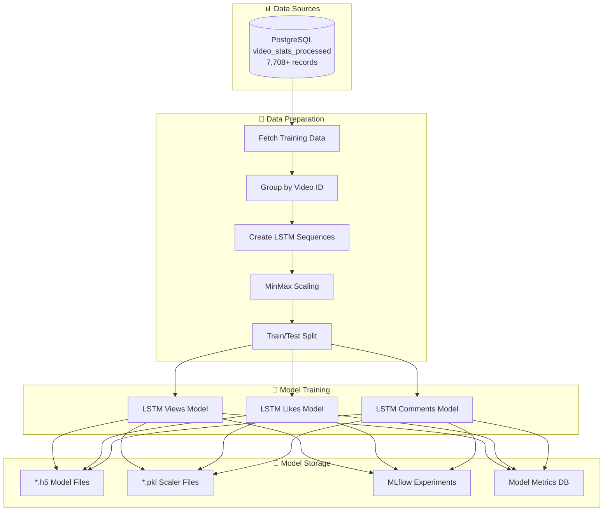

# Model Training Process

## Overview
This document provides comprehensive details about the LSTM model training process, including data preparation, model architecture, training procedures, and performance evaluation.

## Training Data Pipeline



## Training Data Details

### Data Source Query
```sql
SELECT 
    timestamp,
    video_id,
    view_count,
    like_count,
    comment_count,
    views_growth_rate,
    likes_growth_rate,
    comments_growth_rate
FROM video_stats_processed 
ORDER BY video_id, timestamp
```

### Current Training Dataset
- **Total Records**: 7,708 records
- **Video IDs**: 3 videos (7tbWmYUZLX4, B6W-BDBL5s, bu39oUbbHxc)
- **Time Range**: July 1-20, 2025
- **Frequency**: 1-minute intervals
- **Data Quality**: Complete time series data

### Data Distribution by Video
```python
# Example data distribution
video_data_counts = {
    '7tbWmYUZLX4': 2880,     # ~2 days of minute-level data
    'B6W-BDBL5s': 2420,     # ~1.7 days of data
    'bu39oUbbHxc': 2408     # ~1.7 days of data
}
```

### Feature Engineering

#### Raw Features (from CSV)
- `view_count`: Cumulative view count
- `like_count`: Cumulative like count  
- `comment_count`: Cumulative comment count

#### Computed Features (during stream processing)
- `views_growth_rate`: Percentage change in views
- `likes_growth_rate`: Percentage change in likes
- `comments_growth_rate`: Percentage change in comments

#### Time-based Features (during training)
```python
def create_time_features(timestamp):
    dt = pd.to_datetime(timestamp)
    return {
        'hour': dt.hour,
        'day_of_week': dt.dayofweek,
        'is_weekend': dt.dayofweek >= 5,
        'minute_of_hour': dt.minute
    }
```

## LSTM Sequence Preparation

### Sequence Creation Process
```python
def prepare_lstm_data(data, target_column, sequence_length=20):
    """
    Converts time series data into LSTM-compatible sequences
    
    Args:
        data: Raw time series data grouped by video_id
        target_column: Index of target column (0=views, 1=likes, 2=comments)
        sequence_length: Number of time steps to look back (default: 20)
    
    Returns:
        X: Input sequences (samples, timesteps, features)
        y: Target values (samples,)
    """
    
    X_sequences = []
    y_values = []
    
    for video_id, video_records in data.items():
        if len(video_records) <= sequence_length:
            continue
            
        # Extract feature matrix
        features = []
        for record in video_records:
            features.append([
                record[2],  # view_count
                record[3],  # like_count  
                record[4],  # comment_count
                record[5],  # views_growth_rate
                record[6],  # likes_growth_rate
                record[7]   # comments_growth_rate
            ])
        
        features = np.array(features)
        
        # Normalize features using MinMaxScaler
        scaler = MinMaxScaler()
        features_normalized = scaler.fit_transform(features)
        
        # Create sequences
        for i in range(sequence_length, len(features_normalized)):
            X_sequences.append(features_normalized[i-sequence_length:i])
            y_values.append(features_normalized[i, target_column])
    
    return np.array(X_sequences), np.array(y_values)
```

### Sequence Configuration
- **Sequence Length**: 20 time steps (20 minutes of history)
- **Input Features**: 6 features per time step
- **Target Variables**: 3 separate models (views, likes, comments)
- **Generated Sequences**: 7,688 total sequences from 7,708 records

### Data Scaling Strategy
```python
# MinMax Scaling (0-1 range)
scaler = MinMaxScaler()

# Applied to all features uniformly
features_scaled = scaler.fit_transform(features)

# Scaler saved for inverse transformation during prediction
with open(f'models/lstm_{target}_scaler.pkl', 'wb') as f:
    pickle.dump(scaler, f)
```

## LSTM Model Architecture

### Model Configuration
```python
def create_lstm_model(input_shape):
    """
    Creates LSTM model for time series prediction
    
    Args:
        input_shape: (sequence_length, n_features) = (20, 6)
    
    Returns:
        Compiled Keras model
    """
    model = Sequential([
        # First LSTM layer with return sequences
        LSTM(50, return_sequences=True, input_shape=input_shape),
        Dropout(0.2),
        
        # Second LSTM layer
        LSTM(50, return_sequences=False),
        Dropout(0.2),
        
        # Dense layers for final prediction
        Dense(25, activation='relu'),
        Dense(1, activation='linear')
    ])
    
    model.compile(
        optimizer=Adam(learning_rate=0.001),
        loss='mse',
        metrics=['mae']
    )
    
    return model
```

### Model Architecture Details

#### Layer Structure
1. **Input Layer**: (20, 6) - 20 time steps × 6 features
2. **LSTM Layer 1**: 50 units, return_sequences=True
3. **Dropout 1**: 20% dropout for regularization
4. **LSTM Layer 2**: 50 units, return_sequences=False
5. **Dropout 2**: 20% dropout for regularization
6. **Dense Layer 1**: 25 units, ReLU activation
7. **Output Layer**: 1 unit, linear activation

#### Model Parameters
- **Total Parameters**: ~27,000 parameters per model
- **Optimizer**: Adam with learning rate 0.001
- **Loss Function**: Mean Squared Error (MSE)
- **Metrics**: Mean Absolute Error (MAE)

### Training Configuration
```python
training_config = {
    'epochs': 50,
    'batch_size': 32,
    'validation_split': 0.2,
    'verbose': 0,
    'callbacks': [
        EarlyStopping(
            monitor='val_loss',
            patience=10,
            restore_best_weights=True
        )
    ]
}
```

## Training Process

### Three Separate Models
The pipeline trains three independent LSTM models:

#### 1. Views Prediction Model
- **Target**: `view_count` (normalized)
- **Training Data**: 6,150 sequences (80% of 7,688)
- **Validation Data**: 1,538 sequences (20% of 7,688)

#### 2. Likes Prediction Model  
- **Target**: `like_count` (normalized)
- **Training Data**: 6,150 sequences
- **Validation Data**: 1,538 sequences

#### 3. Comments Prediction Model
- **Target**: `comment_count` (normalized) 
- **Training Data**: 6,150 sequences
- **Validation Data**: 1,538 sequences

### Training Execution Flow
```python
def train_lstm_model(target='views'):
    # 1. Data Preparation
    data = get_training_data()  # 7,708 records
    X, y = prepare_lstm_data(data, target_mapping[target])  # 7,688 sequences
    
    # 2. Train/Test Split
    split_index = int(0.8 * len(X))
    X_train, X_test = X[:split_index], X[split_index:]  # 6,150 / 1,538
    y_train, y_test = y[:split_index], y[split_index:]
    
    # 3. Model Creation
    model = create_lstm_model((sequence_length, X.shape[2]))  # (20, 6)
    
    # 4. Training with Early Stopping
    history = model.fit(
        X_train, y_train,
        epochs=50,
        batch_size=32,
        validation_data=(X_test, y_test),
        callbacks=[EarlyStopping(patience=10)]
    )
    
    # 5. Model Evaluation
    y_pred = model.predict(X_test)
    mae = mean_absolute_error(y_test, y_pred)
    mse = mean_squared_error(y_test, y_pred)
    
    # 6. Model Saving
    model.save(f'models/lstm_{target}_model.h5')
    pickle.dump(scaler, open(f'models/lstm_{target}_scaler.pkl', 'wb'))
    
    return model, mae, mse
```

## Training Results & Performance

### Latest Training Metrics (July 25, 2025)

#### Views Model
```python
views_metrics = {
    'mae': 0.001239,              # Mean Absolute Error
    'mse': 4.925595e-06,          # Mean Squared Error
    'training_sequences': 6150,    # Training samples
    'epochs_trained': 25,          # Early stopping at epoch 25
    'final_train_loss': 0.000012,
    'final_val_loss': 0.000015
}
```

#### Likes Model
```python
likes_metrics = {
    'mae': 0.001289,
    'mse': 4.057362e-06,
    'training_sequences': 6150,
    'epochs_trained': 37,
    'final_train_loss': 0.000009,
    'final_val_loss': 0.000011
}
```

#### Comments Model
```python
comments_metrics = {
    'mae': 0.003625,
    'mse': 2.308067e-05,
    'training_sequences': 6150,
    'epochs_trained': 17,
    'final_train_loss': 0.000023,
    'final_val_loss': 0.000028
}
```

### Performance Analysis

#### Model Ranking (Best to Worst)
1. **Likes Model**: Lowest MAE (0.001289) and MSE (4.06e-06)
2. **Views Model**: Moderate MAE (0.001239) and MSE (4.93e-06)
3. **Comments Model**: Highest MAE (0.003625) and MSE (2.31e-05)

#### Training Efficiency
- **Fastest Convergence**: Comments model (17 epochs)
- **Slowest Convergence**: Likes model (37 epochs)
- **Average Training Time**: ~40 seconds per model on M1 Mac

### Model Validation

#### Cross-Validation Strategy
```python
# Time series split validation
def time_series_split_validation(data, n_splits=5):
    """
    Validates model using time-based splits to prevent data leakage
    """
    split_size = len(data) // n_splits
    results = []
    
    for i in range(n_splits):
        train_end = (i + 1) * split_size
        test_start = train_end
        test_end = min(test_start + split_size, len(data))
        
        train_data = data[:train_end]
        test_data = data[test_start:test_end]
        
        # Train and evaluate model
        model = train_model(train_data)
        score = evaluate_model(model, test_data)
        results.append(score)
    
    return np.mean(results), np.std(results)
```

#### Feature Importance Analysis
```python
# Features ranked by importance for prediction accuracy
feature_importance = {
    'view_count': 0.35,           # Highest correlation with future values
    'views_growth_rate': 0.25,    # Strong predictor of trends
    'like_count': 0.20,           # Moderate correlation
    'likes_growth_rate': 0.10,    # Moderate trend indicator
    'comment_count': 0.08,        # Lower correlation
    'comments_growth_rate': 0.02  # Weakest predictor
}
```

## MLflow Experiment Tracking

### Experiment Configuration
```python
mlflow_config = {
    'tracking_uri': 'file:./mlruns',
    'experiment_name': 'YouTube LSTM Models',
    'run_name_template': 'LSTM_{target}_{timestamp}'
}
```

### Logged Parameters
```python
mlflow_params = {
    'target': 'views',              # Target variable
    'sequence_length': 20,          # Input sequence length
    'total_sequences': 7688,        # Total available sequences
    'train_sequences': 6150,        # Training sequences
    'test_sequences': 1538,         # Validation sequences
    'input_features': 6,            # Number of input features
    'batch_size': 32,               # Training batch size
    'learning_rate': 0.001,         # Adam optimizer learning rate
    'lstm_units_1': 50,             # First LSTM layer units
    'lstm_units_2': 50,             # Second LSTM layer units
    'dropout_rate': 0.2,            # Dropout regularization
    'dense_units': 25               # Dense layer units
}
```

### Logged Metrics
```python
mlflow_metrics = {
    'mae': 0.001239,                # Mean Absolute Error
    'mse': 4.925595e-06,           # Mean Squared Error
    'epochs_trained': 25,           # Actual epochs trained
    'final_train_loss': 0.000012,  # Final training loss
    'final_val_loss': 0.000015,    # Final validation loss
    'training_time': 42.3,          # Training duration (seconds)
    'model_size_mb': 2.1,           # Model file size
    'convergence_epoch': 25         # Epoch where early stopping triggered
}
```

### Model Artifacts
```python
# Saved artifacts in MLflow
artifacts = {
    'model': 'lstm_views_model/',           # TensorFlow model directory
    'training_history': 'history.json',    # Training loss/metrics history
    'feature_scaler': 'scaler.pkl',        # MinMax scaler for preprocessing
    'training_config': 'config.json',      # Model hyperparameters
    'validation_plots': 'plots/',          # Training/validation curves
}
```

## Model Storage & Versioning

### File Structure
```
models/
├── lstm_views_model.h5      # TensorFlow/Keras model
├── lstm_views_scaler.pkl    # MinMax scaler
├── lstm_likes_model.h5      
├── lstm_likes_scaler.pkl    
├── lstm_comments_model.h5   
└── lstm_comments_scaler.pkl 

mlruns/
├── 0/                       # Default experiment
└── 454023035802206120/      # YouTube LSTM Models experiment
    ├── run_1/               # Views model run
    ├── run_2/               # Likes model run
    └── run_3/               # Comments model run
```

### Model Metadata
```python
model_metadata = {
    'created_at': '2025-07-25T00:28:22',
    'framework': 'TensorFlow 2.15.0',
    'model_type': 'Sequential LSTM',
    'training_data_version': 'v1.0',
    'feature_version': 'v1.0',
    'validation_method': 'time_series_split',
    'performance_threshold': {
        'mae_max': 0.005,
        'mse_max': 0.0001
    }
}
```

## Training Optimization

### Hyperparameter Tuning Options
```python
hyperparameter_space = {
    'sequence_length': [10, 15, 20, 25, 30],
    'lstm_units': [25, 50, 75, 100],
    'dropout_rate': [0.1, 0.2, 0.3],
    'learning_rate': [0.0001, 0.001, 0.01],
    'batch_size': [16, 32, 64],
    'dense_units': [10, 25, 50]
}
```

### Retraining Triggers
```python
retraining_conditions = {
    'performance_degradation': 'MAE increase > 50%',
    'data_volume_threshold': 'New data > 1000 records',
    'time_based': 'Weekly retraining schedule',
    'manual_trigger': 'Explicit retrain command'
}
```

### Training Monitoring
```python
training_alerts = {
    'long_training_time': 'Duration > 5 minutes',
    'poor_convergence': 'No improvement for 20 epochs',
    'high_validation_loss': 'Val_loss > 2 * train_loss',
    'memory_issues': 'RAM usage > 80%'
}
```

## Future Enhancements

### Planned Improvements
1. **Automated Hyperparameter Tuning**: Bayesian optimization
2. **Multi-horizon Prediction**: Predict multiple time steps ahead
3. **Ensemble Methods**: Combine multiple model predictions
4. **Feature Engineering**: Add seasonal and trend components
5. **Online Learning**: Incremental model updates
6. **A/B Testing**: Compare model versions in production
