# YouTube Analytics Pipeline Flow

## Architecture Overview

```mermaid
graph TD
    %% Data Sources
    CSV[📊 CSV Files<br/>data/video_id/*.csv]
    
    %% Infrastructure
    subgraph "🐳 Docker Infrastructure"
        ZK[Zookeeper<br/>:2181]
        KAFKA[Kafka<br/>:9092]
        PG[(PostgreSQL<br/>:5432)]
        MB[Metabase<br/>:3000]
        MLF_DOCKER[MLflow Docker<br/>:5001]
    end
    
    %% Processing Components
    subgraph "🐍 Python Components"
        PRODUCER[kafka_producer.py<br/>📤 CSV → Kafka]
        PROCESSOR[stream_processor.py<br/>⚙️ Kafka → PostgreSQL]
        LSTM[lstm_pipeline.py<br/>🧠 LSTM Training & Prediction]
        SCHEDULER[prediction_scheduler.py<br/>⏰ Automated Predictions]
    end
    
    %% Storage & Tracking
    subgraph "💾 Local Storage"
        MODELS[models/<br/>*.h5, *.pkl]
        MLRUNS[mlruns/<br/>MLflow Experiments]
        MLF_LOCAL[MLflow Local<br/>:5002]
    end
    
    %% Database Tables
    subgraph "🗄️ PostgreSQL Tables"
        T1[video_stats_processed<br/>7,708+ records]
        T2[predictions<br/>ML predictions]
        T3[model_metrics<br/>Training metrics]
        T4[hourly_aggregations<br/>Time summaries]
    end
    
    %% Data Flow
    CSV --> PRODUCER
    PRODUCER --> KAFKA
    KAFKA --> PROCESSOR
    PROCESSOR --> PG
    
    %% ML Pipeline Flow
    PG --> LSTM
    LSTM --> MODELS
    LSTM --> MLRUNS
    LSTM --> PG
    
    %% Scheduler Flow
    SCHEDULER -.-> LSTM
    SCHEDULER -.-> PG
    
    %% Storage Details
    PG --> T1
    PG --> T2
    PG --> T3
    PG --> T4
    
    %% Visualization
    PG --> MB
    MLRUNS --> MLF_LOCAL
    
    %% Infrastructure Dependencies
    ZK --> KAFKA
    PG --> MB
    
    %% Styling
    classDef storage fill:#e1f5fe
    classDef processing fill:#f3e5f5
    classDef infrastructure fill:#fff3e0
    classDef output fill:#e8f5e8
    
    class CSV,MODELS,MLRUNS,PG storage
    class PRODUCER,PROCESSOR,LSTM,SCHEDULER processing
    class ZK,KAFKA,MLF_DOCKER infrastructure
    class MB,MLF_LOCAL,T1,T2,T3,T4 output
```

## Detailed Data Flow

## Component Responsibilities

## Service Dependencies

## Quick Commands Reference

| Step | Command                                                        | Purpose                    |
|------|----------------------------------------------------------------|----------------------------|
| 1    | `docker-compose up -d`                                         | Start infrastructure       |
| 2    | `pyenv activate youtube-analysis`                              | Activate Python env        |
| 3    | `python src/kafka_producer.py`                                 | Stream CSV → Kafka         |
| 4    | `python src/stream_processor.py`                               | Process Kafka → PostgreSQL |
| 5    | `python src/lstm_pipeline.py`                                  | Train models & predict     |
| 6    | `python src/prediction_scheduler.py --mode auto --interval 15` | Automated predictions      |

## Access Points

- **Data**: PostgreSQL at `localhost:5432`
- **Dashboards**: Metabase at `http://localhost:3000`
- **ML Experiments**: MLflow at `http://localhost:5002`
- **Message Queue**: Kafka at `localhost:9092`
