# Prediction Process

## Overview
This document details the prediction process for the YouTube Analytics LSTM models, including prediction types, data requirements, scheduling, configuration, and adjustment mechanisms.

## Prediction Architecture

```mermaid
graph TD
    subgraph "📊 Input Data"
        DB[(PostgreSQL<br/>Latest 20 records)]
        MODELS[Trained Models<br/>*.h5 + *.pkl]
    end
    
    subgraph "🔍 Prediction Types"
        MANUAL[Manual Prediction<br/>lstm_pipeline.py]
        SCHEDULED[Scheduled Prediction<br/>prediction_scheduler.py]
        AUTO[Auto Prediction<br/>Smart Fallback]
    end
    
    subgraph "🧠 Model Selection"
        LSTM_AVAIL{LSTM Models<br/>Available?}
        LSTM_PRED[LSTM Prediction]
        SIMPLE_PRED[Simple Linear<br/>Prediction]
    end
    
    subgraph "📈 Prediction Outputs"
        VIEWS[Next Views<br/>Count]
        LIKES[Next Likes<br/>Count]
        COMMENTS[Next Comments<br/>Count]
        CONFIDENCE[Confidence<br/>Score]
    end
    
    subgraph "💾 Storage"
        PRED_TABLE[predictions table]
        LOGS[Prediction Logs]
    end
    
    DB --> MANUAL
    DB --> SCHEDULED
    MODELS --> LSTM_AVAIL
    MANUAL --> LSTM_AVAIL
    SCHEDULED --> LSTM_AVAIL
    AUTO --> LSTM_AVAIL
    
    LSTM_AVAIL -->|Yes| LSTM_PRED
    LSTM_AVAIL -->|No| SIMPLE_PRED
    
    LSTM_PRED --> VIEWS
    LSTM_PRED --> LIKES
    LSTM_PRED --> COMMENTS
    SIMPLE_PRED --> VIEWS
    SIMPLE_PRED --> LIKES
    SIMPLE_PRED --> COMMENTS
    
    VIEWS --> PRED_TABLE
    LIKES --> PRED_TABLE
    COMMENTS --> PRED_TABLE
    CONFIDENCE --> PRED_TABLE
    LSTM_PRED --> LOGS
    SIMPLE_PRED --> LOGS
```



## Prediction Types & Execution

### 1. Manual Prediction
```bash
# Run complete pipeline (training + prediction)
python src/lstm_pipeline.py

# Output example:
# INFO:__main__:LSTM prediction for 7tbWmYUZLX4: Views 472727, Likes 7469, Comments 1160
```

**Process:**
1. Trains models if needed
2. Makes predictions for all available videos
3. Stores results in database
4. Logs to MLflow

### 2. Scheduled Prediction
```bash
# Auto predictions every 15 minutes
python src/prediction_scheduler.py --mode auto --interval 15

# LSTM-only predictions every 5 minutes
python src/prediction_scheduler.py --mode lstm --interval 5

# Simple predictions every 30 minutes
python src/prediction_scheduler.py --mode simple --interval 30
```

**Scheduler Configuration:**
```python
scheduler_options = {
    'interval': 15,           # Minutes between predictions (default: 15)
    'mode': 'auto',          # auto, lstm, simple
    'continuous': True,       # Run indefinitely
    'error_handling': 'retry' # retry, skip, stop
}
```

### 3. Auto Prediction (Smart Fallback)
The system automatically chooses the best available prediction method:

```python
def auto_prediction_logic():
    if tensorflow_available and models_exist:
        return "LSTM Prediction"
    elif tensorflow_available and not models_exist:
        train_models()
        return "LSTM Prediction"
    else:
        return "Simple Linear Prediction"
```

## Data Requirements

### Input Data Specification
```python
input_requirements = {
    'minimum_records': 20,        # Sequence length requirement
    'required_fields': [
        'timestamp',
        'video_id', 
        'view_count',
        'like_count',
        'comment_count',
        'views_growth_rate',
        'likes_growth_rate', 
        'comments_growth_rate'
    ],
    'data_freshness': '< 1 hour',  # Prefer recent data
    'sequence_continuity': True     # No gaps in time series
}
```

### Data Fetching Query
```sql
-- Get latest 20 records for each video for prediction
WITH latest_data AS (
    SELECT 
        timestamp,
        video_id,
        view_count,
        like_count,
        comment_count,
        views_growth_rate,
        likes_growth_rate,
        comments_growth_rate,
        ROW_NUMBER() OVER (
            PARTITION BY video_id 
            ORDER BY timestamp DESC
        ) as rn
    FROM video_stats_processed
    WHERE timestamp >= NOW() - INTERVAL '2 hours'  -- Ensure recent data
)
SELECT * FROM latest_data 
WHERE rn <= 20  -- Last 20 records
ORDER BY video_id, timestamp;
```

### Current Data Availability
```python
# Data status as of prediction time
data_status = {
    'total_records': 7708,
    'available_videos': ['7tbWmYUZLX4', 'B6W-BDBL5s', 'bu39oUbbHxc'],
    'records_per_video': {
        '7tbWmYUZLX4': 2880,
        'B6W-BDBL5s': 2420,
        'bu39oUbbHxc': 2408
    },
    'latest_timestamp': '2025-07-05 23:59:31',
    'prediction_eligible': True  # All videos have >20 records
}
```

## LSTM Prediction Process

### Step-by-Step Prediction Flow
```python
def make_lstm_prediction(video_id):
    # 1. Data Preparation
    recent_data = fetch_recent_data(video_id, limit=20)
    if len(recent_data) < 20:
        return None, "Insufficient data"
    
    # 2. Load Models and Scalers
    views_model, views_scaler = load_lstm_model('views')
    likes_model, likes_scaler = load_lstm_model('likes')
    comments_model, comments_scaler = load_lstm_model('comments')
    
    # 3. Prepare Input Sequence
    features = extract_features(recent_data)  # Shape: (20, 6)
    features_scaled = views_scaler.transform(features)  # Normalize
    input_sequence = features_scaled.reshape(1, 20, 6)  # Add batch dimension
    
    # 4. Make Predictions
    views_pred_scaled = views_model.predict(input_sequence, verbose=0)[0, 0]
    likes_pred_scaled = likes_model.predict(input_sequence, verbose=0)[0, 0]
    comments_pred_scaled = comments_model.predict(input_sequence, verbose=0)[0, 0]
    
    # 5. Inverse Transform (Denormalize)
    views_pred = inverse_transform_prediction(views_pred_scaled, views_scaler, recent_data)
    likes_pred = inverse_transform_prediction(likes_pred_scaled, likes_scaler, recent_data)
    comments_pred = inverse_transform_prediction(comments_pred_scaled, comments_scaler, recent_data)
    
    # 6. Apply Business Logic Constraints
    predictions = apply_constraints({
        'views': views_pred,
        'likes': likes_pred,
        'comments': comments_pred
    }, recent_data[-1])  # Use latest actual values as baseline
    
    return predictions, "success"
```

### Feature Extraction for Prediction
```python
def extract_features(data_records):
    """
    Converts 20 recent records into feature matrix for LSTM input
    
    Input: List of 20 database records
    Output: numpy array (20, 6) with features:
           [view_count, like_count, comment_count, 
            views_growth_rate, likes_growth_rate, comments_growth_rate]
    """
    features = []
    for record in data_records:
        features.append([
            float(record['view_count']),
            float(record['like_count']),
            float(record['comment_count']),
            float(record['views_growth_rate']),
            float(record['likes_growth_rate']),
            float(record['comments_growth_rate'])
        ])
    
    return np.array(features)
```

### Prediction Range & Scale

#### Prediction Horizon
- **Time Horizon**: Next 1 time step (1 minute ahead)
- **Prediction Frequency**: Configurable (default: every 15 minutes)
- **Look-back Window**: 20 minutes of historical data

#### Expected Prediction Ranges (per video)
```python
# Based on training data analysis
prediction_ranges = {
    '7tbWmYUZLX4': {
        'views': {'min': 450000, 'max': 475000, 'typical_change': 20},
        'likes': {'min': 7400, 'max': 7600, 'typical_change': 2},
        'comments': {'min': 1150, 'max': 1170, 'typical_change': 1}
    },
    'B6W-BDBL5s': {
        'views': {'min': 380000, 'max': 420000, 'typical_change': 25},
        'likes': {'min': 6200, 'max': 6800, 'typical_change': 3},
        'comments': {'min': 950, 'max': 1050, 'typical_change': 2}
    },
    'bu39oUbbHxc': {
        'views': {'min': 290000, 'max': 330000, 'typical_change': 15},
        'likes': {'min': 4800, 'max': 5200, 'typical_change': 2},
        'comments': {'min': 720, 'max': 820, 'typical_change': 1}
    }
}
```

#### Recent Prediction Examples
```python
# Latest LSTM predictions (July 25, 2025)
recent_predictions = {
    'video_id': '7tbWmYUZLX4',
    'timestamp': '2025-07-25 00:28:22',
    'predictions': {
        'views': 472727,      # Predicted next minute views
        'likes': 7469,        # Predicted next minute likes  
        'comments': 1160      # Predicted next minute comments
    },
    'current_values': {       # Latest actual values used as baseline
        'views': 472705,
        'likes': 7468,
        'comments': 1160
    },
    'predicted_changes': {
        'views': +22,         # Expected increase in 1 minute
        'likes': +1,          # Expected increase in 1 minute
        'comments': 0         # No change expected
    }
}
```

## Simple Linear Prediction (Fallback)

### Fallback Logic
```python
def make_simple_predictions():
    """
    Fallback prediction method when LSTM models unavailable
    Uses linear regression on recent growth trends
    """
    
    recent_data = get_recent_data(limit=5)  # Last 5 minutes
    
    for video_id, records in recent_data.items():
        if len(records) < 2:
            continue
            
        # Calculate average growth rates
        avg_views_growth = np.mean([r['views_growth_rate'] for r in records])
        avg_likes_growth = np.mean([r['likes_growth_rate'] for r in records])
        avg_comments_growth = np.mean([r['comments_growth_rate'] for r in records])
        
        # Apply growth to latest values
        latest = records[-1]
        predictions = {
            'views': int(latest['view_count'] * (1 + avg_views_growth/100)),
            'likes': int(latest['like_count'] * (1 + avg_likes_growth/100)), 
            'comments': int(latest['comment_count'] * (1 + avg_comments_growth/100))
        }
        
        store_predictions(video_id, predictions, model_used='simple_linear')
```

### Simple vs LSTM Comparison
```python
performance_comparison = {
    'LSTM': {
        'accuracy': 'High (MAE: 0.001-0.004)',
        'computation_time': '~200ms per prediction',
        'data_requirements': '20+ sequential records',
        'model_dependencies': 'TensorFlow, trained models'
    },
    'Simple Linear': {
        'accuracy': 'Medium (MAE: 0.01-0.05)',
        'computation_time': '~5ms per prediction',
        'data_requirements': '2+ recent records',
        'model_dependencies': 'None (pure calculation)'
    }
}
```

## Prediction Scheduling

### Scheduler Configuration Options
```python
# Command line arguments
scheduler_args = {
    '--interval': {
        'type': int,
        'default': 15,
        'help': 'Prediction interval in minutes',
        'range': [1, 1440]  # 1 minute to 24 hours
    },
    '--mode': {
        'choices': ['lstm', 'simple', 'auto'],
        'default': 'auto',
        'help': 'Prediction method'
    },
    '--videos': {
        'type': str,
        'default': 'all',
        'help': 'Comma-separated video IDs or "all"'
    },
    '--max-runs': {
        'type': int,
        'default': None,
        'help': 'Maximum prediction runs (None = infinite)'
    }
}
```

### Scheduler Execution Flow
```python
def run_prediction_scheduler(interval_minutes=15):
    """
    Main scheduler loop for automated predictions
    """
    logger.info(f"Starting prediction scheduler - every {interval_minutes} minutes")
    
    run_count = 0
    while True:
        try:
            start_time = time.time()
            
            # 1. Check data availability
            data = get_training_data()
            logger.info(f"Found {len(data)} records for prediction")
            
            if len(data) >= 20:
                # 2. Ensure models exist (auto-training)
                if not models_exist() and tensorflow_available:
                    logger.info("Models not found, training first...")
                    train_all_lstm_models()
                
                # 3. Execute predictions
                if tensorflow_available and models_exist():
                    predictions = make_lstm_predictions()
                else:
                    predictions = make_simple_predictions()
                
                # 4. Log results
                execution_time = time.time() - start_time
                logger.info(f"✅ Prediction completed in {execution_time:.2f}s")
                
            else:
                logger.warning("Not enough data for predictions")
            
            run_count += 1
            
            # 5. Wait for next interval
            logger.info(f"Next run in {interval_minutes} minutes")
            time.sleep(interval_minutes * 60)
            
        except KeyboardInterrupt:
            logger.info("Scheduler stopped by user")
            break
        except Exception as e:
            logger.error(f"Prediction error: {e}")
            time.sleep(60)  # Wait 1 minute before retry
```

### Scheduling Strategies
```python
scheduling_options = {
    'fixed_interval': {
        'description': 'Predictions every N minutes',
        'use_case': 'Regular monitoring',
        'example': '--interval 15'
    },
    'adaptive_interval': {
        'description': 'Adjust interval based on data volatility',
        'use_case': 'Optimize for accuracy vs resources',
        'implementation': 'Future enhancement'
    },
    'event_driven': {
        'description': 'Predict when significant changes detected',
        'use_case': 'React to viral content',
        'implementation': 'Future enhancement'
    },
    'business_hours': {
        'description': 'More frequent during peak hours',
        'use_case': 'Optimize for viewer activity patterns',
        'implementation': 'Future enhancement'
    }
}
```

## Prediction Storage

### Database Schema
```sql
CREATE TABLE predictions (
    id SERIAL PRIMARY KEY,
    video_id VARCHAR(50) NOT NULL,
    predicted_views BIGINT,
    predicted_likes BIGINT, 
    predicted_comments BIGINT,
    prediction_date TIMESTAMP DEFAULT CURRENT_TIMESTAMP,
    model_used VARCHAR(50),            -- 'lstm_ensemble', 'simple_linear'
    confidence_score DECIMAL(5,4),     -- 0.0 to 1.0
    input_data_points INTEGER,         -- Number of data points used
    prediction_horizon_minutes INTEGER DEFAULT 1,
    actual_views BIGINT,               -- Filled later for evaluation
    actual_likes BIGINT,               -- Filled later for evaluation
    actual_comments BIGINT,            -- Filled later for evaluation
    evaluation_date TIMESTAMP,         -- When actual values were recorded
    
    CONSTRAINT unique_video_prediction UNIQUE(video_id, prediction_date)
);
```

### Storage Process
```python
def store_predictions(video_id, predictions, model_used='lstm_ensemble'):
    """
    Store prediction results in database
    """
    query = """
    INSERT INTO predictions (
        video_id, predicted_views, predicted_likes, predicted_comments,
        model_used, confidence_score, input_data_points, prediction_horizon_minutes
    ) VALUES (%s, %s, %s, %s, %s, %s, %s, %s)
    """
    
    confidence = calculate_confidence_score(predictions, model_used)
    
    cursor.execute(query, (
        video_id,
        predictions['views'],
        predictions['likes'],
        predictions['comments'],
        model_used,
        confidence,
        20,  # LSTM uses 20 data points
        1    # 1 minute horizon
    ))
    
    conn.commit()
```

### Current Prediction Data
```sql
-- Check recent predictions
SELECT * FROM predictions ORDER BY prediction_date DESC LIMIT 5;

id | video_id    | predicted_views | predicted_likes | predicted_comments | prediction_date     | model_used
---|-------------|-----------------|-----------------|--------------------|---------------------|--------------
1  | 7tbWmYUZLX4 | 472727          | 7469            | 1160               | 2025-07-25 00:28:22 | lstm_ensemble
2  | 7tbWmYUZLX4 | 471205          | 7442            | 1159               | 2025-07-24 23:15:10 | lstm_ensemble
3  | B6W-BDBL5s  | 395840          | 6534            | 998                | 2025-07-24 22:30:45 | lstm_ensemble
```

## Prediction Adjustment & Configuration

### Real-time Adjustments
```python
adjustment_parameters = {
    'prediction_bounds': {
        'min_growth_rate': -0.1,      # Max 10% decrease per minute
        'max_growth_rate': 0.5,       # Max 50% increase per minute
        'monotonic_enforcement': True  # Views can only increase
    },
    'confidence_thresholds': {
        'high_confidence': 0.9,       # Use prediction as-is
        'medium_confidence': 0.7,     # Apply smoothing
        'low_confidence': 0.5,        # Fall back to simple method
    },
    'outlier_detection': {
        'z_score_threshold': 3.0,     # Flag outliers beyond 3 standard deviations
        'temporal_consistency': True,  # Check against recent trends
    }
}
```

### Business Logic Constraints
```python
def apply_business_constraints(predictions, current_values):
    """
    Apply business rules to prediction outputs
    """
    constrained_predictions = {}
    
    for metric in ['views', 'likes', 'comments']:
        predicted_value = predictions[metric]
        current_value = current_values[metric]
        
        # Rule 1: Values cannot decrease (for cumulative metrics)
        if predicted_value < current_value:
            predicted_value = current_value
        
        # Rule 2: Growth rate limits
        growth_rate = (predicted_value - current_value) / current_value
        if growth_rate > 0.01:  # Max 1% growth per minute
            predicted_value = int(current_value * 1.01)
        
        # Rule 3: Minimum realistic increments
        min_increment = {'views': 1, 'likes': 0, 'comments': 0}
        if predicted_value < current_value + min_increment[metric]:
            predicted_value = current_value + min_increment[metric]
        
        constrained_predictions[metric] = predicted_value
    
    return constrained_predictions
```

### Configuration Adjustment Options

#### Model Parameters
```python
# Adjustable model parameters (requires retraining)
model_config_adjustable = {
    'sequence_length': [10, 15, 20, 25, 30],    # History window
    'prediction_horizon': [1, 5, 15, 30, 60],   # Minutes ahead
    'feature_selection': [                       # Input features to use
        'all_features',
        'counts_only', 
        'growth_rates_only',
        'custom_selection'
    ],
    'model_complexity': {
        'lstm_units': [25, 50, 75, 100],
        'num_layers': [1, 2, 3],
        'dropout_rate': [0.1, 0.2, 0.3, 0.4]
    }
}
```

#### Runtime Parameters
```python
# Adjustable runtime parameters (no retraining needed)
runtime_config_adjustable = {
    'prediction_frequency': {
        'options': [1, 5, 15, 30, 60],  # Minutes
        'default': 15,
        'description': 'How often to make new predictions'
    },
    'confidence_threshold': {
        'range': [0.1, 1.0],
        'default': 0.7,
        'description': 'Minimum confidence to use LSTM vs fallback'
    },
    'smoothing_factor': {
        'range': [0.0, 1.0],
        'default': 0.8,
        'description': 'Weight of prediction vs recent trend'
    },
    'outlier_rejection': {
        'options': [True, False],
        'default': True,
        'description': 'Reject predictions beyond reasonable bounds'
    }
}
```

### Adjustment Commands
```python
# Examples of prediction adjustment commands

# Adjust prediction frequency
python src/prediction_scheduler.py --interval 5  # Every 5 minutes

# Use only simple predictions
python src/prediction_scheduler.py --mode simple

# Adjust confidence threshold in code
pipeline.confidence_threshold = 0.8

# Modify prediction bounds
pipeline.prediction_bounds = {
    'max_growth_rate': 0.2,  # Stricter growth limits
    'outlier_z_threshold': 2.5
}
```

## Performance Monitoring

### Prediction Accuracy Tracking
```python
def evaluate_prediction_accuracy():
    """
    Compare predictions with actual values when available
    """
    query = """
    SELECT 
        p.video_id,
        p.predicted_views, a.view_count as actual_views,
        p.predicted_likes, a.like_count as actual_likes,
        p.predicted_comments, a.comment_count as actual_comments,
        p.prediction_date,
        ABS(p.predicted_views - a.view_count) as views_error,
        ABS(p.predicted_likes - a.like_count) as likes_error,
        ABS(p.predicted_comments - a.comment_count) as comments_error
    FROM predictions p
    JOIN video_stats_processed a ON (
        p.video_id = a.video_id 
        AND a.timestamp BETWEEN p.prediction_date AND p.prediction_date + INTERVAL '2 minutes'
    )
    WHERE p.prediction_date >= NOW() - INTERVAL '24 hours'
    """
    
    results = execute_query(query)
    
    accuracy_metrics = {
        'views_mae': np.mean([r['views_error'] for r in results]),
        'likes_mae': np.mean([r['likes_error'] for r in results]),
        'comments_mae': np.mean([r['comments_error'] for r in results]),
        'total_predictions': len(results)
    }
    
    return accuracy_metrics
```

### Real-time Monitoring Dashboard
```python
monitoring_metrics = {
    'prediction_frequency': 'Predictions per hour',
    'average_latency': 'Time from data to prediction',
    'model_accuracy': 'MAE for each target variable',
    'system_health': 'Success rate, error counts',
    'data_freshness': 'Age of input data used',
    'resource_usage': 'CPU, memory, disk usage'
}
```

This comprehensive prediction system provides flexible, accurate forecasting with multiple fallback options and extensive configuration capabilities for optimal performance across different scenarios.
